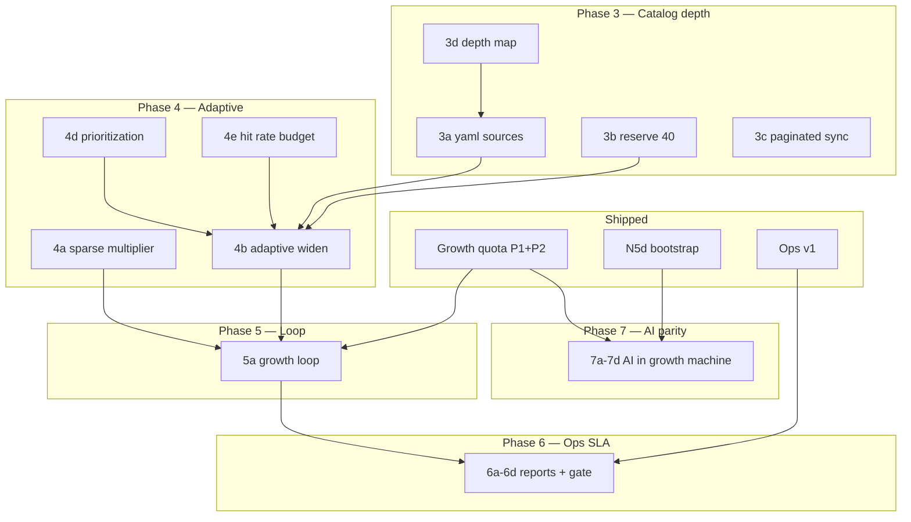

# Unified plan — uninhibited library growth

**Status:** active · **Branch:** `feat/native-experience`  
**Goal:** Every growth pass adds **≥20 probe-verified titles per rail** (more for sparse rails), with **no software cap** on pool depth, until catalog sources are exhausted.  
**Companion docs:** [`phase-n3c-catalog-depth.md`](phase-n3c-catalog-depth.md) · [`phase-n5d-ai-catalog-bootstrap.md`](phase-n5d-ai-catalog-bootstrap.md)

---

## North star

| Metric | Target |
|--------|--------|
| Per growth pass | ≥20 `verified_added` on ≥80% of browse rails |
| Sparse rails | ≥50 `verified_added` when pool < 50% median |
| 30-day median pool | ≥100 verified titles per browse rail |
| Nightly ops report | Majority `growth_quota_met: true`; shortfall explained (`exhausted` vs `hit_rate`) |
| AI rails | Create → visible ≥6 within bootstrap SLA; then same growth quotas as yaml rails |

**Additive contract unchanged:** verified titles stay unless stale; verification quality gates (probe, duration, supplemental filter) stay.

---

## Architecture (three layers)

```
┌─────────────────────────────────────────────────────────────┐
│  Layer C — Agent & AI rails (N5c/N5d)                       │
│  compose → bootstrap → gardener/LLM add_ids → ingest        │
└───────────────────────────┬─────────────────────────────────┘
                            │
┌───────────────────────────▼─────────────────────────────────┐
│  Layer B — Growth engine (N3c)                                │
│  mode=growth · quota · attempt budget · verify queue          │
└───────────────────────────┬─────────────────────────────────┘
                            │
┌───────────────────────────▼─────────────────────────────────┐
│  Layer A — Catalog depth (sources)                          │
│  mdblist reserve · composite sources · paginated ingest       │
└─────────────────────────────────────────────────────────────┘
```

Without **Layer A**, Layer B burns attempt budget on `no_stream`. Without **Layer B**, Layer C fills AI rails once then stalls. Without **Layer C**, voice-created rails don’t join the growth machine.

---

## Shipped baseline (do not re-build)

| Area | What | Key paths |
|------|------|-----------|
| **Growth quota P1+P2** | `growth` refresh mode; `growth_quota: 20`; `growth_attempt_budget: 80`; no `pool_max`; nightly timer → `--mode growth` | `pool-growth.ts`, `refresh.ts`, `catalog.example.yaml`, `install-playability-timer.sh` |
| **N5d bootstrap** | Thematic compose, async bootstrap, migrate empty slots, agent truth (`visible_on_tab`) | `ai-catalogs/compose.ts`, `bootstrap.ts` |
| **Ops visibility v1** | `ops/events.jsonl`, `ops-report.py`, maintenance + companion nightly logs | `ops/log.ts`, `scripts/diag/ops-report.py` |
| **Companion nightly** | 04:30 timer — rule → LLM → gardener → migrate | `companion-nightly-consolidate.sh` |

**Pi deploy gap:** growth yaml + timer reinstall may not be on device until next deploy.

---

## Unified phases (remaining work)

### Phase 3 — Catalog source depth (Layer A)

**Problem:** Rails stall at ~30 verified when mdblist pages exhaust; low hit rate on thin sources.

| ID | Deliverable | Files / actions | Gate |
|----|-------------|-----------------|------|
| 3a | **Composite source expansion** — add 1–2 mdblist catalogs per thin rail (documentaries, series-global, india) | `config/catalog.example.yaml`, `catalog-rail-curation.md` | Manual: depth report shows +100 headroom |
| 3b | **MDBList reserve 26→40** — horror/hindi/comedy/doc/TV niches | `config/ai-catalog-reserve.json`, `gate-n5d-mdblist-reserve.sh` | Reserve gate ≥40 |
| 3c | **Paginated AIOMetadata sync** — cursor per catalog, not just first page | `aiometadata-config.sh`, `aiometadata_mango.py` | Import gate; active list page 2+ fetchable |
| 3d | **Source depth map** — estimated catalog size + ingest offset per rail | `config/catalog-source-depth.json`, `scripts/diag/catalog-depth-report.py` | Gate warns if rail <100 unseen candidates |

**Acceptance:** `catalog-depth-report.py` shows every browse rail with ≥200 unique candidate IDs reachable without re-scanning same page.

**Effort:** ~3–4 days (3a curation parallel with 3b–3d)

---

### Phase 4 — Adaptive growth intelligence (Layer B)

**Problem:** Single pass queues 80 attempts but stops at quota logic without reacting to zero yield.

| ID | Deliverable | Files | Gate |
|----|-------------|-------|------|
| 4a | **Sparse-rail multiplier** — quota ×2.5 when verified < 50% median pool | `pool-growth.ts` `createGrowthPassState()` | Unit test: thin rail gets quota 50 |
| 4b | **Adaptive ingest widening** — on `verified_added < quota && catalog_exhausted`: jump offset full page, rotate composite source, escalate AI compose fallback | `candidate-ingest.ts`, `refresh.ts`, `bootstrap.ts` | Integration: exhausted rail widens on 2nd pass |
| 4c | **Growth-only fail retry** — `no_stream` retry 24h during growth pass (not 7d) | `config.ts` `playabilityFailedRetryMsForReason` | Unit test |
| 4d | **Candidate prioritization** — order queue: `add_ids` → cached-debrid resolve skip → catalog rank → cross-rail verified link | `pipeline.ts`, `list-source.ts` | Hit rate +5% on Pi sample rail |
| 4e | **Rolling hit rate** — per-rail verify success ratio; dynamic `attempt_budget = ceil(quota / hit_rate * 1.3)` | `pool-growth.ts`, `playability.db` or ops jsonl | Budget scales when hit rate low |

**Acceptance:** On Pi, re-run growth pass on `series-global-popular` after 3a; `verified_added` ≥10 (up from ~1) OR `exhausted` with widened source logged.

**Effort:** ~2.5 days

---

### Phase 5 — Nightly growth loop (Layer B schedule)

**Problem:** One 03:00 shot (~minutes) cannot reach 20×12 rails when hit rate is 15%.

| ID | Deliverable | Files | Gate |
|----|-------------|-------|------|
| 5a | **`playability-growth-loop.sh`** — loop `maintenance --mode growth` until all `growth_quota_met` OR 90min wall OR 3 stalls | New script; called from timer | Dry-run completes ≥2 rounds |
| 5b | **Timer points at loop** — replace one-shot service | `install-playability-timer.sh` | `systemctl --user cat mango-playability-indexer.service` |
| 5c | **Overnight grow uses growth mode** — not legacy `full` chunks | `overnight-playability-grow.sh` | Chunk JSON shows `mode: growth` |
| 5d | **Couch window policy** — growth loop 03:00–04:30; companion 04:30 (no overlap) | Timer units doc in script headers | Both timers enabled, no lock conflict |

**Acceptance:** One manual loop run on Pi adds ≥20 verified on ≥8/12 yaml rails within 90min (when AIOStreams healthy).

**Effort:** ~1 day

---

### Phase 6 — Ops SLA & dev visibility (cross-cutting)

**Problem:** Pass can “succeed” with +0/rails skipped; hard to diagnose hit rate vs exhaustion.

| ID | Deliverable | Files | Gate |
|----|-------------|-------|------|
| 6a | **Growth SLA in ops-report** — table: rail, quota, added, attempts, hit_rate, quota_met, exhausted | `ops-report.py` | `--date yesterday` shows SLA section |
| 6b | **`gate-n3c-growth-sla.sh`** — warn if <80% rails met quota without exhausted flag (post-loop) | New gate; hook in `gate-lite.sh` after deploy | Gate on Pi |
| 6c | **Per-pass summary in events.jsonl** — `growth_shortfall_rails[]` with reason | `ops/record.ts` | Event payload includes shortfall |
| 6d | **Companion/agent audit line** — gardener `add_ids` + LLM catalog_hints in nightly report | `ops-report.py` reconstruct | Report shows agent updates |

**Acceptance:** After nightly loop, Mac agent can read one report and answer “which rails missed quota and why.”

**Effort:** ~1 day

---

### Phase 7 — AI rail growth parity (Layer C)

**Problem:** AI rails bootstrap once; gardener hints partially consumed; `topup_suggestions` not ingested.

| ID | Deliverable | Files | Gate |
|----|-------------|-------|------|
| 7a | **Bootstrap top-up uses growth mode** — `runTopUpRound` respects quota not pool target | `bootstrap.ts`, `top-up.ts` | Horror rail bootstrap +20 in one job when sources deep |
| 7a | **Gardener → ingest** — `add_ids` already merged; verify priority in 4d covers this | existing | Gardener event → next growth pass verifies add_ids |
| 7b | **LLM catalog_hints → add_ids** — nightly LLM already writes hints; gate that they appear in slot yaml | `companion-nightly-llm.py`, N5c gate | Gate |
| 7c | **AI rails in growth loop** — `ai-*` rails included in loop + depth report | `refresh.ts` (already includes ai_catalog) | ops report lists `ai-horror` quota |
| 7d | **Reserve lazy import in growth pass** — if ingest exhausts mdblist, trigger `ensure-catalogs` for next reserve list | `catalog-activate.ts`, compose | Log “import pending” → pool still grows from seeds |

**Acceptance:** Voice-create niche rail → bootstrap visible → within 7 nights `ai-*` pool ≥40 verified.

**Effort:** ~1 day (mostly wiring + gates)

---

## Execution timeline (recommended)

```
Week 1 ──► Phase 3 (sources) + Pi deploy baseline (growth yaml + timer)
         └── 3a yaml curation ∥ 3b reserve ∥ 3d depth map

Week 2 ──► Phase 4 (adaptive) + Phase 5 (loop)
         └── 4a sparse ∥ 4b widen; then 5a loop on Pi

Week 3 ──► Phase 6 (ops SLA) + Phase 7 (AI parity)
         └── gates in gate-lite; 7d lazy import

Ongoing ─► Phase 3c paginated sync; expand 3a as depth report flags thin rails
```

**Critical path:** 3a/3b (sources) → 4b (widen) → 5a (loop) → 6b (SLA proof). Phases 4a, 4d, 6a can parallelize.

---

## Dependency graph



---

## Gates checklist (definition of done)

| Gate | When |
|------|------|
| `gate-n3c-growth-quota.sh` | Every catalog-service change (exists) |
| `gate-n3c-growth-sla.sh` | After Phase 6; run post-nightly on Pi |
| `gate-n5d-mdblist-reserve.sh` | Phase 3b — reserve ≥40 |
| `catalog-depth-report.py --warn` | Phase 3d — no rail <100 headroom |
| `gate-lite.sh` | Pre-couch; includes growth SLA when loop enabled |
| Manual: growth loop dry-run | Phase 5 — ≥2 rounds, ops jsonl populated |

---

## Explicitly out of scope (this program)

- Raising TV `display_limit` above 9 (10-ft UI)
- Removing mpv probe / play-ladder verification
- Unbounded probe concurrency (Pi thermals / debrid limits)
- Voice agent changing compose sources directly (server compose only — N5d D7)

---

## Pi deploy runbook (after each phase)

```bash
# Mac: push feat/native-experience
bash scripts/pi-deploy.sh

# Pi: catalog yaml (when 3a changes)
# merge growth_quota fields into /etc/mango/catalog.yaml

# Pi: timer (when 5b changes)
bash scripts/phase-n3c/install-playability-timer.sh
bash scripts/phase-n5/install-companion-nightly-timer.sh

# Verify
bash scripts/phase-n3c/gate-n3c-growth-quota.sh
python3 scripts/diag/ops-report.py --reconstruct
```

---

## Summary table — all phases

| Phase | Name | Layer | Status | Effort |
|-------|------|-------|--------|--------|
| P0 | N5d bootstrap + ops v1 + companion nightly | C + ops | **Shipped** | — |
| P1+P2 | Growth quota mode + yaml + timer | B | **Shipped** (deploy Pi) | — |
| **P3** | Catalog source depth | A | Planned | ~3–4d |
| **P4** | Adaptive growth intelligence | B | Planned | ~2.5d |
| **P5** | Nightly growth loop | B | Planned | ~1d |
| **P6** | Ops SLA & visibility | ops | Partial | ~1d |
| **P7** | AI rail growth parity | C | Planned | ~1d |

**Total remaining:** ~8–10 dev-days to full north star, plus yaml curation ongoing.
