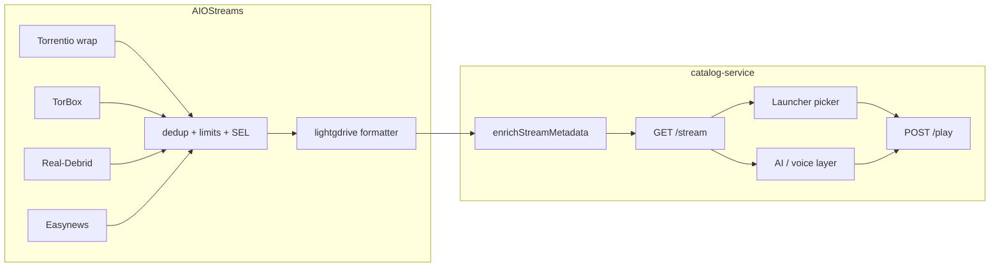

# AIOStreams profile for mango

**Branch:** `feat/native-experience`  
**Pi instance:** v2.30.3 @ `127.0.0.1:3035`  
**Headless API:** `GET` / `PUT` `/api/v1/user` (Basic auth: UUID + password from `~/.config/mango/aiostreams.credentials`)

This doc maps **every useful AIOStreams knob** to mango’s north star (legit catalogs, ~5 s play, mpv-only, TB-first, 1080p lab cap until N7 OLED) and records **current vs target** for the Pi.

---

## Division of labor

AIOStreams is the **stream aggregation + hygiene** layer. mango `catalog-service` is the **play orchestration + lab policy** layer.

| Concern | AIOStreams | mango `catalog-filters.json` |
|---------|------------|------------------------------|
| Combine Torrentio + TorBox + RD + Easynews | **Yes** | No |
| Deduplicate identical releases | **Yes** | No (only auto-play diversify) |
| Drop cam / ts / scr / hdcam | **Yes** (primary) | Safety net in scoring |
| Block uncached Real-Debrid | **Yes** (already) | Yes (redundant OK) |
| Block RD WEBRip / WEB-DL / AMZN | **Yes** (SEL expressions) | No (moved upstream) |
| TorBox before Real-Debrid | **Yes** (service order + sort + SEL) | Scoring boost only |
| Cap result count (stop 40× “same” row) | **Yes** (result limits) | No |
| Easynews only when torrents thin | **Yes** (groups) | No |
| Full upstream quality (2160p REMUX, DV) | **Yes** (no resolution cap) | **No** — `max_quality: 1080p` until N7 |
| Exclude remux on Pi lab | No | **Yes** `exclude_remux` |
| Title mismatch (London.Files) | Optional TMDB title match | **Yes** `streamMatchesMetaTitle` |
| mpv probe, playability DB, verified hints | No | **Yes** |
| Auto-play tiers, wall clock, uncached TB fallback | **No** (disable AIOStreams autoPlay) | **Yes** |
| Catalogs / mdblist rails | No (use AIOLists) | YAML rails |

**Rule:** Push **dedup, junk keywords, cache policy, debrid ranking, and row limits** upstream into AIOStreams. Keep **probe-time policy, lab quality cap, and couch auto-play** in mango.

---

## Measured problem (Pi, evaluation corpus)

See `config/stream-gate-fixtures.json`. Snapshot 2026-06-19:

| Title | Streams | Unique URLs | Notes |
|-------|---------|-------------|-------|
| Shawshank `tt0111161` | 3 | 3 | Western baseline |
| RRR `tt8178634` | 5 | 5 | Hindi/Telugu |
| Dhurandhar `tt33014583` | 8 | 8 | 2025 Hindi |
| Panchayat `tt12004706:1:1` | 3 | 3 | series needs S1E1 id |
| India's Got Latent `tt33094114:1:1` | 1 | 1 | thin but valid |
| SpongeBob `tt0206512:1:1` | 8 | 8 | animation |

Typical row: `[TB⚡] Torrentio 1080p` repeated — formatter hides different infohashes. Gate checks **URL diversity** per title; post-S7 also checks **`display_label`** diversity.

---

## Configuration surface (configure UI)

AIOStreams v2.30 configure menu sections and how mango should use each.

### Services

| Knob | What it does | mango recommendation |
|------|----------------|----------------------|
| Service list order | Dedup winner + sort priority when service is a sort key | **TorBox → Real-Debrid → Easynews** (locked) |
| Enable/disable per provider | Turns sources on | TB, RD, Easynews **ON**; all other debrid/usenet **OFF** |
| RPDB key (services footer) | Posters for catalog addons inside AIOStreams | **Skip** — posters from Cinemeta / AIOLists |
| Service Wrap | Routes marketplace addons through your debrid | **ON** |
| Reconfigure Service | Re-wrap after credential change | Off unless rotating keys |
| Processing Services | Which services process wrapped streams | Default (TorBox + RD) |
| NZB Failover | Usenet path when torrent/debrid thin | **ON** |
| Auto Remove Downloads | Deletes debrid jobs after play | **OFF** (re-watch friendly) |
| Check Library | Boost / filter owned titles | **ON** |
| Cache and Play | Buffer until usenet download completes | **ON**, **usenet stream types only** |
| TMDB / TVDB keys | Title matching, metadata | **Optional** TMDB key if enabling title match |

### Built-in / Addons

| Knob | mango recommendation |
|------|----------------------|
| **Torrentio** (marketplace) | Installed, **resources: stream only**, timeout ~7 s |
| Other built-ins (Comet, MediaFusion, Prowlarr, …) | **OFF** V1 — fewer moving parts |
| Custom addon URLs | **None** V1 |
| Catalogues (inside AIOStreams) | **OFF / not used** — mango uses Cinemeta + AIOLists |
| **Groups** | **Use** — see [Groups](#groups-conditional-fetch) |
| Addon timeout | 7–10 s (Pi maintenance tolerates longer than couch) |

### Filters → Cache

| Knob | Current Pi | Target |
|------|------------|--------|
| Exclude all uncached | — | **Do not** global-block (TorBox cache-in fallback lives in mango) |
| Exclude uncached from **Real-Debrid** | Yes | **Keep** |
| Exclude uncached **debrid** stream type | Yes | **Keep** |
| Exclude uncached usenet | — | **Allow** (Easynews / TB usenet) |

### Filters → Generic attributes

Each attribute section (Resolution, Encode, Stream Type, Visual Tag, Audio, Language) supports **Required / Excluded / Included / Preferred**.

| Attribute | AIOStreams | mango downstream |
|-----------|------------|------------------|
| **Resolution** | No exclusions; prefer 2160p→1080p | `max_quality: 1080p` |
| **Quality** | Exclude CAM, SCR, TS, TC | Scoring penalty on hdcam/ts |
| **Visual tags** | Exclude 3D (optional) | No change |
| **Encode** | No required HEVC (Pi plays HEVC 1080p) | — |
| **Stream type** | Prefer debrid; no P2P for mango | — |
| **Language** | Prefer English (+ Hindi later if indexer supports) | Future: mango audio pref |

**Do not** exclude REMUX, WEB-DL, or 2160p in AIOStreams — N7 OLED should get full upstream without reconfiguring the aggregator.

### Filters → Seeders

| Knob | mango recommendation |
|------|----------------------|
| Required min seeders | **OFF** for debrid (irrelevant once cached) |
| P2P-only seeders filter | N/A while P2P disabled |

### Filters → Matching

| Knob | mango recommendation |
|------|----------------------|
| **Title matching** (TMDB) | **Optional** — helps bad torrent names; mango still does imdb/title pass |
| Season/episode matching | **ON for series** when we expand TV auto-play |
| Year matching | Off V1 |

### Filters → Keyword

Four lists: **Required / Excluded / Included / Preferred**.

| List | Target values (case-insensitive) |
|------|----------------------------------|
| **Excluded** | `cam`, `hdcam`, `camrip`, `telesync`, `ts`, `scr`, `tc`, `dvdscr`, `workprint`, `sample` |
| **Excluded** (RD-only via regex — see below) | `webrip`, `web-dl`, `webdl`, `amzn` on Real-Debrid rows |
| **Preferred** | `bluray`, `blu-ray`, `remux` (rank only — mango still drops remux on Pi) |

Stored in API as `regexOverrides` / ranked regex + SEL when configured in UI.

### Filters → Regex (self-hosted)

| Knob | mango recommendation |
|------|----------------------|
| Access | Instance is localhost — enable regex filters (trusted UUID or `REGEX_FILTER_ACCESS`) |
| Ranked regex | RD WEBRip penalty −1000 or hard exclude |
| Preferred regex | BluRay / 1080p release groups (TRaSH-style) optional |

### Filters → Size

| Knob | mango recommendation |
|------|----------------------|
| Global movie/series size caps | **OFF** (let remux exist upstream; mango caps) |
| Per-resolution size caps | Off V1 |

### Filters → Result limits

AIOStreams supports **global**, **per service**, **per resolution**, **per quality** (BluRay/WEB-DL/WEBRip — not the same as resolution), **per release group**, per addon, per indexer, and per stream type. Two modes:

| Mode | Behaviour |
|------|-----------|
| **independent** (default) | Each enabled cap applies separately. A global `resolution: 2` means **2× 1080p total across all services** — that can block TorBox + RD both showing 1080p. |
| **conjunctive** | Builds a composite key from enabled dimensions (e.g. `1080p\|torbox`). Cap = **min** of enabled limits. Best for **per-service × per-resolution** diversity. |

**mango target** (conjunctive — diversity without duplicate floods):

| Knob | Value | Why |
|------|-------|-----|
| `mode` | `conjunctive` | 2× 1080p **per service**, not 2× 1080p globally |
| `service` | `2` | Up to 2 TorBox + 2 Real-Debrid rows at each tier |
| `resolution` | `2` | 1080p + 720p fallback lane per service (mango still caps >1080p) |
| `releaseGroup` | `1` | One row per release group within each composite cell |
| `global` | `12` | Hard ceiling (~picker + auto-play headroom) |

Effective cap per cell: `min(2, 2, 1) = 1` stream per `(resolution, service, releaseGroup)` tuple — after dedup, that yields **distinct** picks (TB 1080p, RD 1080p, TB 720p, …) instead of 19× the same formatter label.

**Avoid:** global-only limit with no service/resolution split — still clusters on one debrid + one resolution after sort.

### Filters → Deduplicator

| Knob | Current Pi | Target |
|------|------------|--------|
| Enabled | Yes | **Yes** |
| Detection keys | `filename`, `infoHash` | **`infoHash`, `smartDetect`, `filename`** |
| smartDetect attributes | Configured | Keep default set (size, resolution, quality, encode, …) |
| smartDetect rounding | 10 | **10** (tighter → more aggressive dedup) |
| Cached group handling | `single_result` | **Keep** |
| Uncached group handling | `per_service` | **`single_result`** |
| P2P | `single_result` | Keep |
| multiGroupBehaviour | `aggressive` | Keep |
| libraryBehaviour | `ignore` | **`prefer`** (surface unwatched when Check Library on) |
| Tiebreakers (v2.30.3+) | default | **Service order → addon order** |

### Filters → Sorting

Current global sort (Pi): cached → library → resolution → quality → SE score → regex → …

| Add / verify | Why |
|--------------|-----|
| **`service`** early (after cached) | TB before RD without mango re-sort |
| cached desc | Instant play first |
| resolution desc | Best quality first (mango trims to 1080p) |

**Scored sorting (advanced):** ranked regex + SEL for RD WEBRip block and BluRay boost — prefer over duplicating logic only in mango.

### Formatter

| Knob | mango recommendation |
|------|----------------------|
| Preset | Keep cache badges (`[TB⚡]`, `[RD✔]`) — mango scoring parses these |
| Custom format | Optional: include `{stream.releaseGroup}` or short hash suffix so picker rows differ |

### Proxy / Miscellaneous

| Knob | mango recommendation |
|------|----------------------|
| Stream proxy (MediaFlow / StremThru) | **OFF** — localhost mpv, no CDN proxy needed |
| AIOStreams **autoPlay** | **OFF** — conflicts with mango orchestrator (`autoPlay.enabled` is ON today → **disable**) |
| precacheNextEpisode | **OFF** |
| digitalReleaseFilter | **OFF** |
| statistics | On is fine |
| posterService `rpdb` | Low value — catalogs not from AIOStreams |

---

## Groups (conditional fetch)

Use SEL group conditions so Easynews does not run on every resolve.

**Group 1 — Primary:** Torrentio (service-wrapped TB + RD)  
**Condition for Group 2:** `count(cached(previousStreams)) < 3`  
**Group 2 — Usenet:** Easynews Search  

Optional **Group 3** (only if standalone Torrentio stays in export): skip — better to remove duplicate Torrentio addons from `stremio-export.json` once AIOStreams profile is stable.

Example condition (from [AIOStreams groups docs](https://docs.aiostreams.viren070.me/guides/groups/)):

```text
count(cached(previousStreams)) < 3
```

---

## stremio-export.json interaction

Today mango fetches streams from **three** addons in parallel:

1. AIOStreams (already contains Torrentio via Service Wrap)  
2. Torrentio TB  
3. Torrentio RD  

That triples indexer work and defeats dedup. **Phase 2** (after AIOStreams profile applied + gate green):

- Remove Torrentio TB/RD from `/etc/mango/stremio-export.json`
- Simplify `catalog-filters.example.json` auto-play tiers to **AIOStreams-only**
- Keep Torrentio URLs in docs as manual fallback if AIOStreams container is down

---

## Target profile summary

| Area | Setting |
|------|---------|
| Services | TB → RD → EN; Wrap, NZB Failover, Check Library, Cache-and-Play (usenet) ON |
| Torrentio | Built-in, stream-only |
| Dedup | ON; keys: infoHash + smartDetect + filename; cached/uncached: single_result |
| Cache | Exclude uncached RD + debrid type |
| Quality | Exclude CAM/SCR/TS/TC (+ keywords above) |
| Resolution | No cap upstream; prefer 2160p→1080p |
| RD WEBRip | Ranked regex or keyword exclude |
| Result limits | conjunctive: service×resolution×group, global 12 |
| Groups | Easynews if `< 3` cached from group 1 |
| Sort | cached → service → language → resolution → quality |
| Formatter | `lightgdrive` (rich description for picker + AI) |
| AIOStreams autoPlay | **OFF** |
| mango | 1080p + remux cap, probes, tiers, title match, `stream_display_limit: 8` |

---

## Future-ready: picker + AI integration

Design goal: **AIOStreams produces a small, diverse, richly labeled candidate set**; **mango exposes structured fields and query overrides** so the launcher picker and a future voice/AI layer never re-implement indexer logic.

### Layer contract



### AIOStreams choices that unlock the picker

| Knob | Setting | Why it matters later |
|------|---------|----------------------|
| **Formatter `lightgdrive`** | ON | Multi-line description: resolution, encode, release group, language hints — parser input for mango |
| **`preferredLanguages`** | English, Hindi | Sort boost + indexer bias before mango hard-filters |
| **Sort `language`** | Early in global sort | Hindi dub rows surface when user picks Hindi |
| **Conjunctive result limits** | service 2 × resolution 2 × group 1 | ~6–8 **distinct** rows — ideal picker cardinality (not 40 duplicates) |
| **`hideErrors: true`** | ON | AI never sees `[❌]` placeholder rows |
| **`posterService: none`** | ON | Posters from Cinemeta/AIOLists — one poster pipeline |
| **No resolution cap upstream** | Keep 2160p/REMUX in AIOStreams | N7 OLED: drop `max_quality` in mango only |
| **SEL ranked + excluded** | TB boost, RD WEBRip block | Policy in one place; AI reads outcomes, not rules |

### mango API surface (implemented)

`GET /stream/{type}/{id}` query params (optional overrides on top of `catalog-filters.json`):

| Param | Example | Effect |
|-------|---------|--------|
| `language` | `Hindi` | **Hard** filter rows; explicit user/voice intent only |
| `preferred_language` | `Hindi` | **Soft** score boost; never excludes rows |
| `min_quality` | `720p` | Drop rows below floor |
| `max_quality` | `1080p` | Lab cap (default from config) |

Each stream row includes enriched fields from `enrichStreamMetadata()`:

| Field | Source | Picker / AI use |
|-------|--------|-----------------|
| `resolution` | Parsed 2160p/1080p/720p | Quality chip |
| `release_tier` | bluray, webdl, remux, … | “Best copy” badge |
| `display_label` | Parsed formatter fields | 10-ft picker row label |
| `release_group` | `lightgdrive` `🏷️` / fallback filename | Distinguish duplicate titles |
| `encode` | `lightgdrive` `🎞️` / fallback filename | HEVC/AVC chip |
| `size_gb` | `lightgdrive` `📦` / fallback filename | Size hint |
| `indexer` | `lightgdrive` `🔍` | Debug / provenance |
| `hdr_tags` | `lightgdrive` visual line | HDR/DV chip later |
| `languages` | `["English","Hindi"]` | Language filter chips |
| `debrid_service` | `torbox` / `realdebrid` | Service icon |
| `cache_status` | cached / uncached / unknown | ⚡ badge, auto-play eligibility |

`POST /play` accepts the same overrides in JSON body. Future “play Shawshank in
Hindi” maps to `{ "language": "Hindi" }`; “prefer Hindi but English is fine”
maps to `{ "preferred_language": "Hindi" }`.

`stream_display_limit` (default **8**) caps picker rows after rank — keeps UI scannable; AIOStreams `global: 12` leaves headroom for auto-play attempts.

### AI integration path (no new services required)

1. **Intent → overrides** — LLM maps “Hindi dub only” to `language`, “prefer Hindi” to `preferred_language`, and quality constraints to `min_quality` / `max_quality`.
2. **Structured context** — Pass top-N stream objects (not raw Stremio blobs) into the model; fields above are the tool schema.
3. **Verified hints** — `playability` DB `win_url_hash` lets AI say “same link as last time” without re-probing.
4. **No duplicate policy** — AI must not re-rank debrid or block WEBRip; trust AIOStreams order, mango only applies lab cap + probe.

### stremio-export (required for diversity)

Keep **only** Cinemeta, AIOStreams, AIOLists in `/etc/mango/stremio-export.json`. Standalone Torrentio TB/RD duplicates indexer work and collapses unique names (measured: 20 streams → 2 unique labels).

### When N7 OLED ships

| Change | Where |
|--------|-------|
| Allow 2160p + remux | `catalog-filters.json`: remove `max_quality` / `exclude_remux` |
| Optional DV/HDR preference | AIOStreams visual-tag prefer; mango scoring tweak |
| Bigger picker | `stream_display_limit: 12`, AIOStreams `global: 16` |

No AIOStreams reinstall — upstream already carries full quality.

---

## Headless workflow

```bash
# On Pi (or Mac with ssh -L 3035:127.0.0.1:3035 mango)
bash scripts/m4-addons/aiostreams-config.sh get > /tmp/aios-backup.json
bash scripts/m4-addons/aiostreams-config.sh diff   # current vs repo target patch
bash scripts/m4-addons/aiostreams-config.sh apply  # merge target patch + PUT
```

After apply:

```bash
bash scripts/m4-addons/gate-m4-streams.sh
# 6-title corpus — config/stream-gate-fixtures.json
```

---

## References

- [Configure options](https://docs.aiostreams.viren070.me/configuration/options/) — full knob reference  
- [Groups](https://docs.aiostreams.viren070.me/guides/groups/) — conditional addon fetch  
- [Scored sorting](https://docs.aiostreams.viren070.me/guides/scored-sorting/) — ranked regex / SEL  
- [API overview](https://docs.aiostreams.viren070.me/apis/) — `/api/v1/user`  
- mango: `config/catalog-filters.example.json`, `src/catalog-service/src/stream-filters.ts`  
- Operator UI: `scripts/m4-addons/configure-aiostreams.md`
